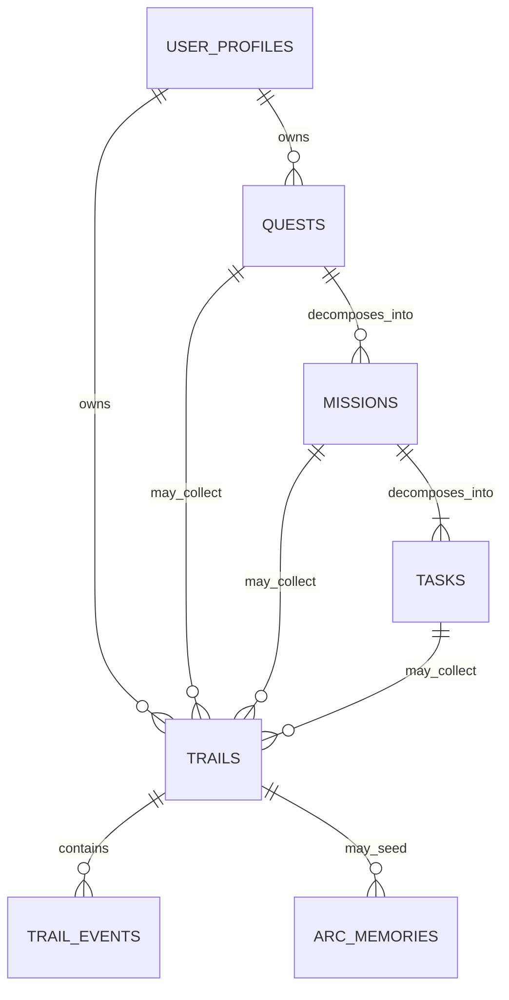

# Quest / Mission / Task / Trail Relationship

Questra's core loop is: define a Quest, reach it through outcome-oriented
Missions, execute concrete Tasks, and leave Trails as proof of the journey.

## Definitions

- Quest: a goal the user wants to make real.
- Mission: a verifiable intermediate outcome or route checkpoint that moves a
  Quest forward.
- Task: the smallest concrete action a user can execute now. Every Task belongs
  to exactly one Mission.
- Trail: a challenge record, achievement record, or lived experience left
  through a Quest, Mission, or Task.

## Relations

## Database Policy

- `missions.quest_id` is required because every Mission exists to move one
  Quest forward.
- `tasks.mission_id` is required because every Task executes one Mission.
- A Mission's progress may be derived from its Tasks, but required Task
  completion does not complete the Mission until the user confirms its success
  condition or expected output.
- `trails.owner_id` is required because every Trail belongs to a user.
- `trails.quest_id`, `trails.mission_id`, and `trails.task_id` are nullable so
  a Trail may describe the whole journey or a specific level of its context.
- `trail_events.quest_id` and `trail_events.mission_id` are nullable so future
  events can be user-owned or Trail-owned before being linked to a Quest.

## MVP UI Flow

1. Home shows today's Task and its parent Mission and Quest context.
2. Quest List opens Quest Detail.
3. Quest Detail shows Guide decomposition, outcome Missions, executable Tasks,
   linked Trails, and Dream Board materials.
4. Users generate Missions from a Guide and Tasks from each Mission.
5. Users complete Tasks, then explicitly confirm the Mission outcome.
6. Users leave a Trail linked to the available Quest, Mission, and Task context.

## Legacy Migration Policy

- Existing Missions that describe a concrete action remain readable during migration.
- A new or derived outcome Mission groups those records, and each legacy action
  becomes a Task candidate after user-visible review.
- IDs, completion state, and Trail links are preserved through compatibility mapping.
- Ambiguous conversions require user approval and must never overwrite the source row.

## Test Policy

- Schema changes require migration review and hosted RLS evidence.
- Flutter checks cover hierarchy semantics, responsive behavior and compile safety.
- Repository tests cover Quest-, Mission-, Task-linked and user-only Trails.
