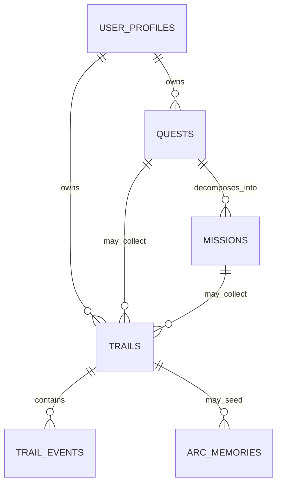

# Quest / Mission / Trail Relationship

Questra's core loop is: create a Quest, move it forward through Missions,
and leave Trails as proof of the journey.

## Definitions

- Quest: a goal the user wants to make real.
- Mission: a concrete action that moves a Quest forward.
- Trail: a challenge record, achievement record, or lived experience left
  through a Quest or Mission.

## Relations

## Database Policy

- `missions.quest_id` is required because every Mission exists to move one
  Quest forward.
- `trails.owner_id` is required because every Trail belongs to a user.
- `trails.quest_id` is nullable because a user may leave a personal Trail
  before choosing the Quest it belongs to.
- `trails.mission_id` is nullable because a Trail can record a whole Quest,
  not only one Mission.
- `trail_events.quest_id` and `trail_events.mission_id` are nullable so future
  events can be user-owned or Trail-owned before being linked to a Quest.

## MVP UI Flow

1. Home shows today's Mission, active Quest progress, recent Trail, and Arc
   guidance.
2. Quest List opens Quest Detail.
3. Quest Detail shows Guide decomposition, generated Missions, linked Trails,
   and Dream Board materials.
4. Users can generate a Mission from a Guide.
5. Users can leave a Trail from Quest Detail; when available, it links to the
   Quest and the latest Mission.

## Test Policy

- Schema changes should be covered by Supabase migration review before a
  hosted database is reset or migrated.
- Flutter checks should cover model nullability and UI compile safety through
  `flutter analyze` and `flutter test`.
- Future repository tests should add controller coverage for Quest-linked,
  Mission-linked, and user-only Trails.
