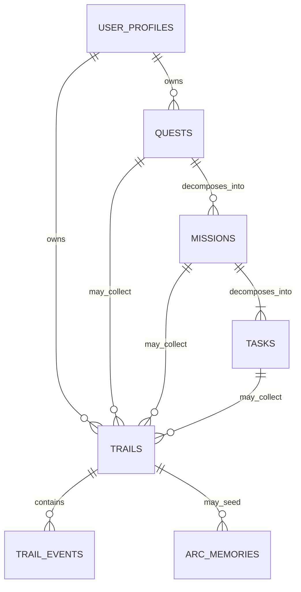

# Legacy Document Path

This historical path is retained so older reports and links remain readable.
The active four-level domain specification is
[`quest-mission-task-trail.md`](quest-mission-task-trail.md). New implementation
decisions must use that document and the Master Spec v2.0.

<!-- Historical content below is retained as a compatibility record. -->

# Quest / Mission / Task / Trail Relationship

Questra's core loop is: define a Quest, reach it through outcome-oriented
Missions, execute concrete Tasks, and leave Trails as proof of the journey.

## Definitions

- Quest: a goal the user wants to make real.
- Mission: a verifiable intermediate outcome or route checkpoint that moves a
  Quest forward.
- Task: the smallest concrete action a user can execute now. Every Task belongs
  to exactly one Mission.
- Trail: a challenge record, achievement record, or lived experience left
  through a Quest, Mission, or Task.

## Relations

```mermaid
erDiagram
  USER_PROFILES ||--o{ QUESTS : owns
  USER_PROFILES ||--o{ TRAILS : owns
  QUESTS ||--o{ MISSIONS : decomposes_into
  MISSIONS ||--|{ TASKS : decomposes_into
  QUESTS ||--o{ TRAILS : may_collect
  MISSIONS ||--o{ TRAILS : may_collect
  TASKS ||--o{ TRAILS : may_collect
  TRAILS ||--o{ TRAIL_EVENTS : contains
  TRAILS ||--o{ ARC_MEMORIES : may_seed
```

## Database Policy

- `missions.quest_id` is required because every Mission exists to move one
  Quest forward.
- `tasks.mission_id` is required because every Task executes one Mission.
- A Mission's progress may be derived from its Tasks, but required Task
  completion does not complete the Mission until the user confirms its success
  condition or expected output.
- `trails.owner_id` is required because every Trail belongs to a user.
- `trails.quest_id` is nullable because a user may leave a personal Trail
  before choosing the Quest it belongs to.
- `trails.mission_id` is nullable because a Trail can record a whole Quest,
  not only one Mission.
- `trails.task_id` is nullable because a Trail may record a specific action,
  a whole Mission, or a whole Quest.
- `trail_events.quest_id` and `trail_events.mission_id` are nullable so future
  events can be user-owned or Trail-owned before being linked to a Quest.

## MVP UI Flow

1. Home shows today's Task and its Mission, active Quest progress, recent Trail, and Arc
   guidance.
2. Quest List opens Quest Detail.
3. Quest Detail shows Guide decomposition, generated Missions and their Tasks, linked Trails,
   and Dream Board materials.
4. Users can generate Missions from a Guide and actionable Tasks from each Mission.
5. Users complete Tasks, then confirm the Mission outcome.
6. Users can leave a Trail from Quest Detail; when available, it links to the
   Quest, Mission, and Task context.

## Legacy Migration Policy

- Existing Missions that describe a concrete action remain readable during migration.
- A new or derived outcome Mission groups those records, and each legacy action
  becomes a Task candidate after user-visible review.
- IDs, completion state, and Trail links are preserved through compatibility mapping.
- Ambiguous conversions require user approval and must never overwrite the source row.

## Test Policy

- Schema changes should be covered by Supabase migration review before a
  hosted database is reset or migrated.
- Flutter checks should cover model nullability and UI compile safety through
  `flutter analyze` and `flutter test`.
- Future repository tests should add controller coverage for Quest-linked,
  Mission-linked, Task-linked, and user-only Trails.
